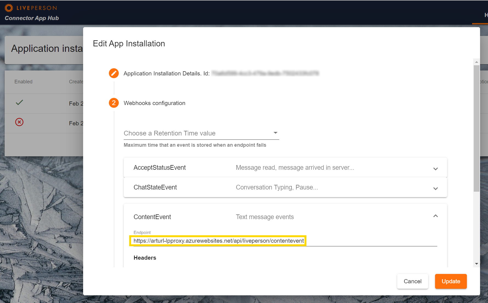
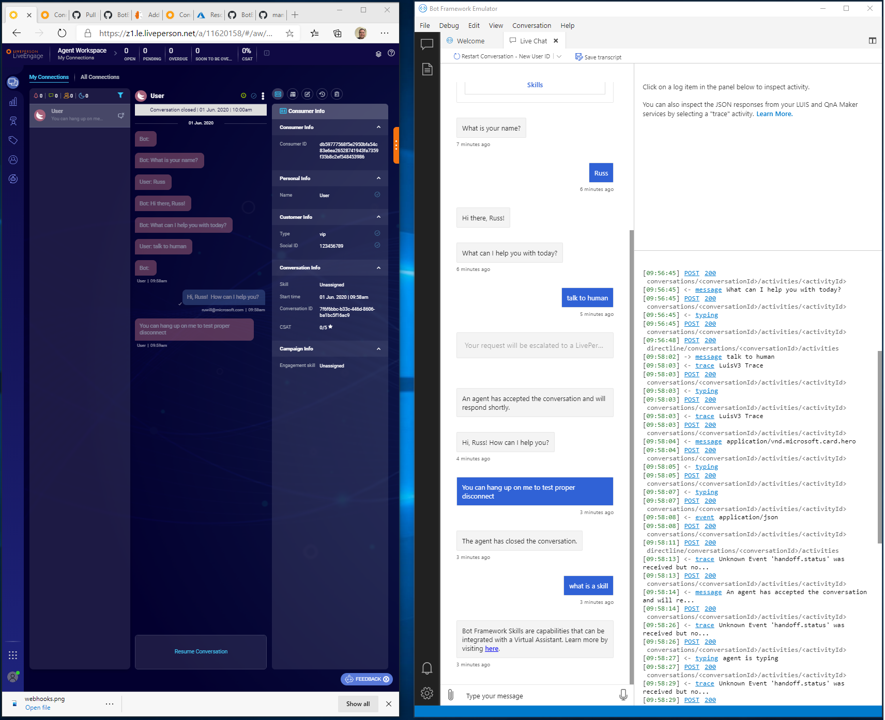

# LivePerson Bot-As-A-Proxy Assistant

This bot-as-a-proxy sample demonstrates how to use the new Bot Framework Handoff APIs and the LivePerson Agent
Hub to integrate human agent escalation with the Virtual Assistant Template.

You can use this sample as-is by configuring it and your LivePerson subscription or you can follow the step-by-step
directions below to integrate agent escalation into an existing Virtual Assistant.  This sample is based on
version 4.9.2 of the Bot Framework and the [BotBuilder-Samples](https://github.com/microsoft/BotBuilder-Samples)
as of 5/28/2020.

# Configuring the sample

Before you run the sample, you'll need to set up your LivePerson account and configure your application as follows:

0. Update to the latest version of all the dependencies for the Virtual Assistant Template list on [here]
1. Get a LivePerson Subscription and access to the Connector App Hub
2. In the LiverPerson portal, create an agent and a skill that will be used when the bot user asks to escalate to a 
human agent.  Configure the LivePerson agent to support the skill you will specify later in step 9:

3. Using Visual Studio, create new VA Template bot. All the integration takes place in the Assistant and not in
the Virtual Assistant Skills and that's why no Virual Assistant Skill project was included in the solution
for this sample.  You'll add your Virtual Skills as you see fit as you normally do.
4. Update NuGet Packages to the newest versions, including bot framework (bot framework version 4.9.2 is what 
this sample uses)
5. Copy the **LivePersonConnector** folder from the [LivePersonProxyBot](https://github.com/microsoft/BotBuilder-Samples/tree/master/experimental/handoff-library/csharp_dotnetcore/samples/LivePersonProxyBot) 
sample into your solution as a sibling project to the Assistant project as was done in this sample.
6. In VS, right-click **Solution** in **Solution Explorer** and choose **Add | Existing Project** to add the 
**LivePersonConnector** project to the solution
7. Right-click Assistant project in Solution Explorer (**LivePersonProxyAssistant** in this sample) and choose
**Add | Project Reference…** and choose the **LivePersonConnector** project you just added
8. Build to make sure everything compiles successfully
9. Make the following changes to the files specified below:

	9.1 Startup.cs
	* Add this using statements:
		``` c#
		using LivePersonProxyBot;
		```
	* Add the following to ConfigureServices()
		``` c#
		// LivePerson dependency injection
		services.AddTransient<LivePersonConnector.ILivePersonCredentialsProvider, LivePersonCredentialsProvider>();
		services.AddSingleton<LivePersonConnector.HandoffMiddleware>();
		services.AddSingleton<LoggingMiddleware>();
        services.AddSingleton<LivePersonConnector.ConversationMap>();
		```
	9.2 Responses\MainResponses.lg
	* Change # EscalatedText as follows:
		``` c#
		# EscalatedText
		- Your request will be escalated to a LivePerson agent
		```
	9.3 Dialogs\MainDialog.cs
	* Add the following using statements:
		``` c#
		using LivePersonProxyBot.Bots;
		using LivePersonConnector;
		```
	* Add the following as a member of the `MainDialog` class
		``` c#
		public IServiceProvider _serviceProvider;
		```
	* Add the following to the constructor:
		``` c#
		_serviceProvider = serviceProvider;
		```
	* Replace the entire `case GeneralLuis.Intent.Escalate:` statement in the `InterruptDialogAsync()` method
	of **MainDialog.cs** with the following:
		``` c#
		case GeneralLuis.Intent.Escalate:
		{
			var conversationState = _serviceProvider.GetService<ConversationState>();
			var conversationStateAccessors = conversationState.CreateProperty<LoggingConversationData>(nameof(LoggingConversationData));
			var conversationData = await conversationStateAccessors.GetAsync(innerDc.Context, () => new LoggingConversationData());
				
			await innerDc.Context.SendActivityAsync(_templateManager.GenerateActivityForLocale("EscalateMessage", userProfile), cancellationToken);
				
			var transcript = new Transcript(conversationData.ConversationLog.Where(a => a.Type == ActivityTypes.Message).ToList());
				
			var evnt = EventFactory.CreateHandoffInitiation(innerDc.Context,
				new
				{
					Skill = "<Your Skill Name>",
					EngagementAttributes = new EngagementAttribute[]
						{
							new EngagementAttribute { Type = "ctmrinfo", CustomerType = "vip", SocialId = "123456789"},
							new EngagementAttribute { Type = "personal", FirstName = innerDc.Context.Activity.From.Name }
						}
				},
				transcript);
				
			await innerDc.Context.SendActivityAsync(evnt);
				
			interrupted = true;
			break;
        }
		```
	NOTE: Replace `"<Your Skill Name>"` with the name of your agent's skill.  So you'd set `Skill` to the string
	`"Expert Help"` if that's how you configured your agent's skill which you can grab from **User Management**
	as shown in the screen shot below:
	
	9.4 Adapters/DefaultAdapter.cs
	* Add the following using statements:
		```c#
		using LivePersonConnector;
		using LivePersonProxyBot;
		using Microsoft.Bot.Connector;
		using LivePersonProxyBot.Bots;
		using Newtonsoft.Json.Linq;
		```
	* Adding the `ILivePersonAdapter` interface to the class declaration like so:
		``` c#
		 public class DefaultAdapter : BotFrameworkHttpAdapter, ILivePersonAdapter
		```
	* Add the following lines as parameters to the `DefaultAdapter` and make sure they come 
	before the optional arguments (i.e. the `"= null"` args):
		``` c#
		LoggingMiddleware loggingMiddleware,
		HandoffMiddleware handoffMiddleware,
		```

		It should look like this when you are done:
		``` c#
		 public DefaultAdapter(
			BotSettings settings,
			ICredentialProvider credentialProvider,
			IChannelProvider channelProvider,
			AuthenticationConfiguration authConfig,
			LocaleTemplateManager templateEngine,
			ConversationState conversationState,
			TelemetryInitializerMiddleware telemetryMiddleware,
			IBotTelemetryClient telemetryClient,
			ILogger<BotFrameworkHttpAdapter> logger,
			LoggingMiddleware loggingMiddleware,
			HandoffMiddleware handoffMiddleware,
			SkillsConfiguration skillsConfig = null,
			SkillHttpClient skillClient = null)
			: base(credentialProvider, authConfig, channelProvider, logger: logger)
		```
	* Add the following `Use()` statements to the code in the `DefaultAdapter` constructor after the 
	`Use(telemetryMiddleware);` statement
		``` c#
		Use(loggingMiddleware);
		Use(handoffMiddleware);
		```
	* Add the following method to the `DefaultAdapter` class:
		``` c#
		public async Task ProcessActivityAsync(Activity activity, string msAppId, ConversationReference conversationRef, BotCallbackHandler callback, CancellationToken cancellationToken)
		{
			BotAssert.ActivityNotNull(activity);
				
			activity.ApplyConversationReference(conversationRef, true);
				
			await ContinueConversationAsync(
				msAppId,
				conversationRef,
				async (ITurnContext proactiveContext, CancellationToken ct) =>
				{
				    using (var contextWithActivity = new TurnContext(this, activity))
				    {
				        contextWithActivity.TurnState.Add(proactiveContext.TurnState.Get<IConnectorClient>());
				        await base.RunPipelineAsync(contextWithActivity, callback, cancellationToken);
				
				        if (contextWithActivity.Activity.Name == "handoff.status")
				        {
				            var conversationStateAccessors = _conversationState.CreateProperty<LoggingConversationData>(nameof(LoggingConversationData));
				            var conversationData = await conversationStateAccessors.GetAsync(contextWithActivity, () => new LoggingConversationData());
				
				            Activity replyActivity;
				            var state = (contextWithActivity.Activity.Value as JObject)?.Value<string>("state");
				            if (state == "typing")
				            {
				                replyActivity = new Activity
				                {
				                    Type = ActivityTypes.Typing,
				                    Text = "agent is typing",
				                };
				            }
				            else if (state == "accepted")
				            {
				                replyActivity = MessageFactory.Text("An agent has accepted the conversation and will respond shortly.");
				                await _conversationState.SaveChangesAsync(contextWithActivity);
				            }
				            else if (state == "completed")
				            {
				                replyActivity = MessageFactory.Text("The agent has closed the conversation.");
				            }
				            else
				            {
				                replyActivity = MessageFactory.Text($"Conversation status changed to '{state}'");
				            }
				
				            await contextWithActivity.SendActivityAsync(replyActivity);
				        }
				    }
				
				},
				cancellationToken).ConfigureAwait(false);
		}
		```
10. Create public endpoint for localhost
	* Open a Command Prompt and run **ngrok** to create a public endpoint for localhost so you can debug events
	coming from the LivePerson agent console by entering the following command:
	```
	<file path to ngrok folder>\ngrok.exe http 3978 -host-header="localhost:3978"
	```	
11. Login to [Connector App Hub](https://connector-api.dev.liveperson.net) and create an App Hub Connection for
your bot.
	* You will need to configure each of the webhook endpoints using the "https" version of the bot endpoint that
	**ngrok** created and use it as a prefix for each event, replacing "<######>" with the correct value:

	https://<######>.ngrok.io/api/liveperson/AcceptStatusEvent

	https://<######>.ngrok.io/api/liveperson/ChatStateEvent

	https://<######>.ngrok.io/api/liveperson/contentevent

	https://<######>.ngrok.io/api/liveperson/RichContentEvent

	https://<######>.ngrok.io/api/liveperson/ExConversationChangeNotification

	You'll need to create a new connection everytime you restart ngrok since updating the endpoint of an
	existing **Connection** does not seem to work.

	You'll eventually create a separate, more permanent **Connection** that points to your deployed bot when
	that becomes more stable.

	Here's what the LivePerson configuration looks like for the ContentEvent:
	
12. Add the following settings to appsetting.json:
	```
	"LivePersonAccount": "",
	"LivePersonClientId": "",
	"LivePersonClientSecret": "",
	```
13. Copy the **App Id** and **Secret** from the App Hub Connection you just created and paste them into the 
corresponding values in the **appsetting.json** file and provide your LivePerson account number as show below:


	Your appsettings.json should look something like this:
	``` c#
	"LivePersonAccount": "12345678",
	"LivePersonClientId": "0dfa22e8-8ffe-54dc-a72c-e6a30fde6c39",
	"LivePersonClientSecret": "c3g8hd4640l9cor9gkfjraq4j0",
	```
14. Compile app to fix any compilation errors
15. Modify the **Deployment\Resources\parameters.template.json** file as you see fit, or not at all
16. Deploy your bot by running the following command from **PowerShell Core** in the project folder of your
Assistant:
	```
	.\Deployment\Scripts\deploy.ps1 -parametersFile .\Deployment\Resources\parameters.template.json
	```

# Running the sample
1. Login to [LivePerson Agent Portal](https://liveengage.liveperson.net) and make sure the agent is online
2. In Visual Studio, run or debug the bot on localhost
	* Note: ngrok should be running and exposing the endpoints your LivePerson Connector App Hub is configure with
3. Use the **Bot Emulator** to test the bot
4. Type "Human" to trigger the `Escalate` Intent defined in **General.lu** which will cause the code you added 
to the `case GeneralLuis.Intent.Escalate:` statement in the `InterruptDialogAsync()` method of **MainDialog.cs**.
	* You should hear the LivePerson phone ring
	* The bot should say the EscalatedText message that you set earlier (i.e. "Your request will be escalated to a LivePerson 
	agent")
5. When you hear the LivePerson console ring the phone, click the Answer button and type a message for the bot user
6. Switch to bot emulator and wait for the agent message to show up (this can be slow the first time you do it)
and the enter the message you want to send to the LivePerson agent
	* You should hear a "bing" sound
7. Switch back to the LivePerson console and check to make sure the message came through and then end the
conversation by clicking the 3 dots in upper right part of conversation canvas and choose "close conversation"
from the dropdown menu
8. Switch back to the bot emulator and you should see the "The agent has closed the conversation" message from 
the agent
9. Check to make sure the conversation has ended and the emulator is talking to the bot again by typing
	"what is a skill" and you should see a correct answer

That's it! You should have a Virtual Assistant bot that is fully integrated with LivePerson uisng the new bot-as-a-proxy
Bot Framework Handoff APIs

